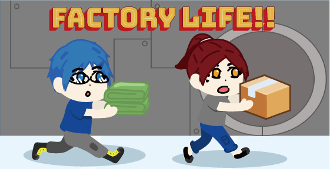

# 
 Factory Life

此APP是一款2v2連線的合作類型競技遊戲，玩家要在有限時間內完成衣服工廠作業線上不同類型的事物以獲取分數，簡單的遊玩方式，考驗的是與隊友間的配合與策略。

***

## List of Contents

1. [Features](#features)
2. [Backend Server](#backendserver)
3. [Database](#database)
4. [Demo](#demo)

<h2 id="features">Features</h2>

我們的特色是透過簡易的遊玩方式，讓玩家們可以進行策略型的競爭，並且可以互相干擾對方行動，透過多人同時遊玩的派對遊戲形式提升玩家對於此遊戲的好感度。

<h2 id="backendserver">Backend Server</h2>

我們使用Photon Server作為我們的backend server，用此建立玩家間的連線，同步玩家的狀態。

<h2 id="database">Database</h2>

Database我們使用SQLite來存取使用者的資料，透過SQLite將使用者的角色選擇、玩家名稱等等狀態存放在使用者的local端。

<h2 id="demo">Demo</h2>

